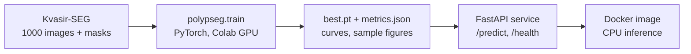
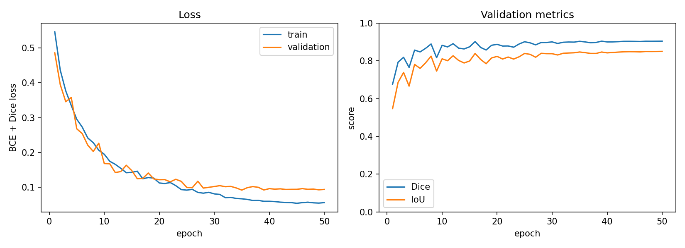
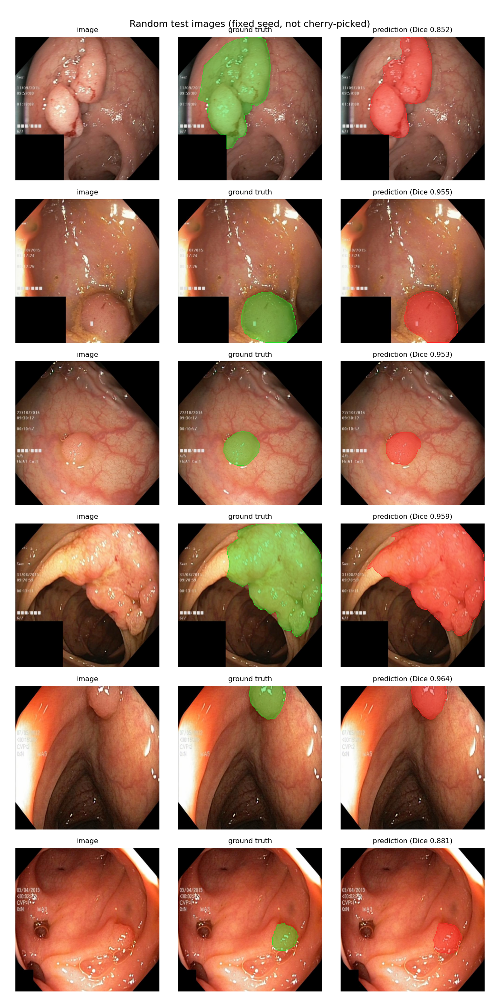
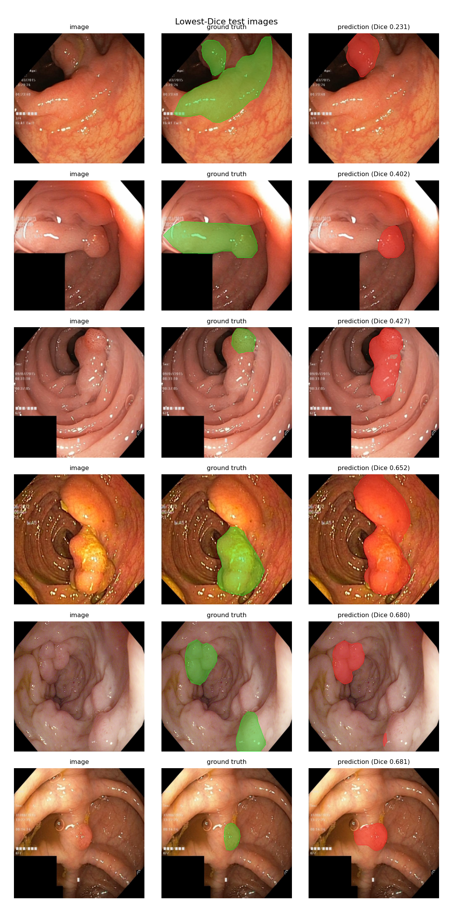

# Polyp Segmentation: PyTorch U-Net, FastAPI, Docker

[](https://github.com/Wajeeh1997/polyp-segmentation/actions/workflows/ci.yml)
[](https://colab.research.google.com/github/Wajeeh1997/polyp-segmentation/blob/main/notebooks/train_colab.ipynb)

End-to-end medical image segmentation: train a U-Net with a pretrained ResNet34 encoder on the public
[Kvasir-SEG](https://datasets.simula.no/kvasir-seg/) colonoscopy dataset, then serve it behind a
FastAPI endpoint packaged in a Docker image.



> **Research demo only.** This model is not a medical device and must not be used for diagnosis or
> any clinical decision.

## Results

Single training run (seed 42). The checkpoint was chosen on a 100-image validation split and then
evaluated once on a separate 100-image test split.

| Metric (mean per image) | Validation | Test |
| --- | --- | --- |
| Dice | 0.905 | **0.916** |
| IoU | 0.850 | **0.862** |
| Precision | 0.921 | 0.933 |
| Recall | 0.924 | 0.921 |

Per-image test Dice: median 0.961, standard deviation 0.121. The mean is pulled down by a few hard
cases (shown below). With only 100 test images, that spread gives a rough 95% interval of about
+/-0.02 around the mean Dice, before counting run-to-run training variance.

Checkpoint: epoch 50 of 50 (best validation Dice) · 24.4M parameters · 18.4 minutes on a Colab
Tesla T4 with mixed precision.



<p align="center">
  
  
</p>

Left: random test images (fixed seed, not hand-picked), ground truth in green and prediction in red.
Right: the six lowest-Dice test images, so the weaknesses are visible too.

### What the figures show

- **Training:** validation Dice levels off around 0.90 after roughly 25 epochs while the training loss
  keeps falling (0.056 train vs 0.094 validation at the end), a modest generalisation gap. The best
  checkpoint is the last epoch; whether a longer schedule would help was not tested.
- **Typical cases:** on single, well-defined polyps the boundaries are tight (Dice about 0.85-0.96).
- **Failure cases:** the six worst images (Dice 0.23-0.68) fall into three patterns: large or
  elongated polyps where only part is segmented, a frame with two polyps where one is missed, and
  over-segmentation into neighbouring tissue that looks similar (in at least one case possibly an
  annotation-ambiguity question rather than a pure model error).

## Quickstart

```bash
git clone https://github.com/Wajeeh1997/polyp-segmentation.git
cd polyp-segmentation
pip install -e ".[train,api,dev]"      # install PyTorch for your platform first if needed

python -m polypseg.download --out-dir data                      # downloads Kvasir-SEG
python -m polypseg.train --data-dir data --out-dir runs/unet_resnet34 \
    --config configs/default.yaml
```

If you already have Kvasir-SEG (for example the Kaggle copy), skip the download and point
`--data-dir` at it: the folder that contains `images/` and `masks/` is found automatically, even
when it is nested a few levels down.

Training needs a GPU to be practical. The notebook `notebooks/train_colab.ipynb` runs the same
commands on a free Colab T4 and stores the checkpoint in Google Drive.

Outputs in `runs/unet_resnet34/`: `best.pt` (best validation Dice), `metrics.json`, `history.csv`,
`curves.png`, `samples.png`, `failure_cases.png`, `splits.json` (exact train/val/test file lists).

Any config value can be overridden: `--override train.epochs=10 data.img_size=256`.

### Predict from the command line

```bash
python -m polypseg.predict --ckpt runs/unet_resnet34/best.pt --image path/to/image_or_folder
```

## Serving with Docker

The checkpoint is not baked into the image. Put it in `./models/best.pt` (for example the file
attached to this repository's GitHub Release) and mount it:

```bash
docker build -t polypseg .
docker run --rm -p 8000:8000 -v "$(pwd)/models:/app/models:ro" polypseg
```

| Endpoint | Description |
| --- | --- |
| `GET /health` | `200` when the model is loaded, `503` otherwise (also used by the Docker healthcheck) |
| `POST /predict` | Multipart upload `file`, optional `threshold` (0-1). Returns JSON with the mask and overlay as base64 PNGs, mask area fraction and inference time |
| `POST /predict/overlay` | Same upload, returns the overlay as a PNG |
| `GET /docs` | Interactive OpenAPI docs |

```bash
curl -X POST "http://localhost:8000/predict/overlay" -F "file=@some_image.jpg" -o overlay.png
curl -X POST "http://localhost:8000/predict" -F "file=@some_image.jpg" | python -m json.tool | head
```

Uploads are limited to 10 MB (`MAX_UPLOAD_MB`) and 25 megapixels; undecodable files get a `400`.
Without Docker: `MODEL_PATH=models/best.pt uvicorn polypseg.api:app --port 8000`.

## Method

- **Data:** Kvasir-SEG, 1,000 polyp images with binary masks (resolutions from 332x487 to 1920x1072).
  Random 80/10/10 split with a fixed seed. Images are resized to 352x352 (this distorts the aspect
  ratio; inference applies the same resize and maps the mask back to the original resolution).
- **Model:** U-Net decoder on an ImageNet-pretrained ResNet34 encoder, written in plain PyTorch
  (`src/polypseg/model.py`), about 24M parameters.
- **Loss:** 0.5 x binary cross-entropy + 0.5 x soft Dice.
- **Training:** AdamW, 2 warm-up epochs then cosine decay, mixed precision on GPU, flips, affine and
  colour-jitter augmentation applied jointly to image and mask. The checkpoint with the best
  validation Dice is evaluated once on the test split.
- **Metrics:** Dice, IoU, precision and recall are computed per image at threshold 0.5 and then
  averaged, so each image counts equally.

## Limitations

- Kvasir-SEG has no patient identifiers, so frames from the same patient or procedure can land in both
  train and test. The random split may therefore give optimistic numbers compared with a
  patient-level split.
- One dataset, one centre, no external validation: results will not necessarily transfer to other
  scopes, lighting or populations.
- Every image contains a polyp, so the model has never seen negative (polyp-free) frames and its
  false-positive behaviour on healthy mucosa is unknown.
- Single training run, one seed, 100 test images: differences of about 0.01 Dice (for example
  validation 0.905 vs test 0.916) are within noise.
- No direct comparison with published results: reported Kvasir-SEG numbers use different splits,
  input sizes and training setups, so they are not comparable to the figures above.

## Development

```bash
pytest -q          # unit tests, API tests and a 2-epoch smoke training run on synthetic data
ruff check .
```

```
src/polypseg/   data.py, model.py, metrics.py, train.py, inference.py, predict.py, api.py, ...
configs/        default.yaml
tests/          data, model, metrics, training smoke test, inference, API
notebooks/      train_colab.ipynb
Dockerfile      CPU inference image
```

## Data and citation

Kvasir-SEG is provided by Simula for research and educational use; the dataset itself is not
included in this repository (the figures above show a few of its test images for illustration).
Please follow its terms and cite:

> Jha, D., Smedsrud, P. H., Riegler, M. A., Halvorsen, P., de Lange, T., Johansen, D., Johansen, H. D.
> "Kvasir-SEG: A Segmented Polyp Dataset." International Conference on Multimedia Modeling (MMM), 2020.

Code released under the MIT License (see `LICENSE`).
