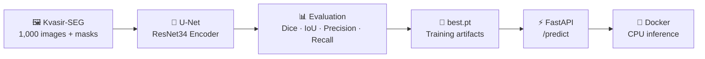
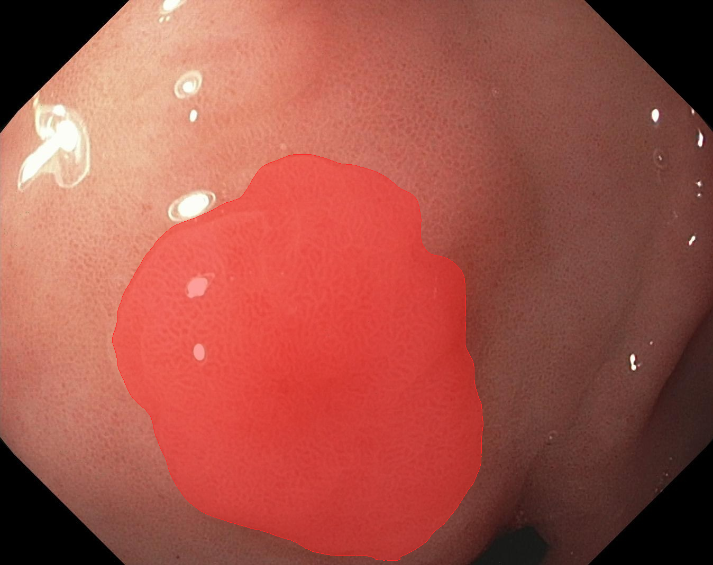

# 🩺 Polyp Segmentation with PyTorch, U-Net & FastAPI

[](https://github.com/Wajeeh1997/polyp-segmentation/actions/workflows/ci.yml)
[](https://colab.research.google.com/github/Wajeeh1997/polyp-segmentation/blob/main/notebooks/train_colab.ipynb)

> **From colonoscopy image → AI segmentation → REST API → Docker deployment.**

An end-to-end deep-learning project for **automatic polyp segmentation** in colonoscopy images.

The project trains a **U-Net with an ImageNet-pretrained ResNet34 encoder** on the public **Kvasir-SEG** dataset, evaluates the model on a held-out test set, and exposes inference through a **FastAPI service** packaged for **CPU inference with Docker**.

### 🏆 Test Performance

| Metric        | Validation |  **Test** |
| ------------- | ---------: | --------: |
| **Dice**      |      0.905 | **0.916** |
| **IoU**       |      0.850 | **0.862** |
| **Precision** |      0.921 | **0.933** |
| **Recall**    |      0.924 | **0.921** |

**24.4M parameters · 50 epochs · 18.4 min training · Colab Tesla T4 · mixed precision**

> ⚠️ **Research / educational demo only.**
> This model is **not a medical device** and must not be used for diagnosis or clinical decision-making.

---

## ✨ What This Project Does

The complete pipeline looks like this:



In other words:

**Train → Evaluate → Visualize → Serve → Deploy**

The project is designed to demonstrate not just model training, but the journey from a computer-vision experiment to a usable inference service.

---

# 📈 Results

The reported results come from a **single training run with seed 42**.

A 100-image validation split was used to select the best checkpoint, followed by evaluation on a separate 100-image test split.

### Quantitative Results

| Metric    | Validation |      Test |
| --------- | ---------: | --------: |
| Dice      |      0.905 | **0.916** |
| IoU       |      0.850 | **0.862** |
| Precision |      0.921 | **0.933** |
| Recall    |      0.924 | **0.921** |

The test-set **median per-image Dice is 0.961**, with a standard deviation of 0.121. The mean is lowered by a small number of difficult cases.

With only 100 test images, the estimated 95% interval around the mean Dice is approximately ±0.02 before accounting for run-to-run training variation.

### Training

* **Best checkpoint:** Epoch 50 / 50
* **Parameters:** ~24.4M
* **Training time:** ~18.4 minutes
* **Hardware:** Google Colab Tesla T4
* **Precision:** Mixed precision
* **Best checkpoint criterion:** Validation Dice


---

## 👀 Qualitative Results

<p align="center">
  
  
</p>

**Left:** randomly selected test images with ground truth in green and predictions in red.

**Right:** the six lowest-Dice test images, intentionally shown to make the model's weaknesses visible.

### What the Model Gets Right

On relatively well-defined polyps, the predicted boundaries are generally close to the ground-truth masks, with typical Dice scores around **0.85–0.96**.

### Where It Struggles

The six lowest-performing test images reveal three recurring patterns:

* Large or elongated polyps where only part of the lesion is segmented.
* Images containing multiple polyps where one may be missed.
* Over-segmentation into surrounding tissue with similar visual appearance.

At least one difficult case may also involve annotation ambiguity rather than being purely a model failure.

**Showing failure cases is intentional:** a useful computer-vision project should demonstrate where the model succeeds *and* where it breaks down.

---

# 🧠 Model & Training

## Architecture

The segmentation network uses:

**U-Net decoder + ImageNet-pretrained ResNet34 encoder**

```text
Input Image
     │
     ▼
┌─────────────────────┐
│ ResNet34 Encoder    │
│ ImageNet pretrained │
└─────────┬───────────┘
          │
          │ Skip Connections
          ▼
┌─────────────────────┐
│ U-Net Decoder       │
│ Upsampling + Fusion │
└─────────┬───────────┘
          │
          ▼
   Binary Polyp Mask
```

The model contains approximately **24 million parameters**.

## Loss Function

The training objective combines binary cross-entropy and soft Dice loss:

```text
Loss = 0.5 × BCE + 0.5 × Soft Dice Loss
```

## Training Strategy

The training pipeline uses:

* AdamW optimizer
* 2 warm-up epochs
* Cosine learning-rate decay
* Mixed precision on GPU
* Horizontal/vertical flips
* Affine augmentation
* Colour jitter
* Joint image/mask augmentation
* Best-checkpoint selection based on validation Dice

---

# 🗂️ Dataset

The project uses **Kvasir-SEG**, containing:

* **1,000 colonoscopy images**
* Corresponding **binary polyp masks**
* Image resolutions ranging from approximately **332×487 to 1920×1072**

The data is split randomly into:

```text
80% Training
10% Validation
10% Test
```

using a fixed seed.

Images are resized to **352×352** during training and inference. This changes the original aspect ratio; inference subsequently maps the predicted mask back to the original resolution.

Kvasir-SEG is not included in this repository. Download it separately from the official dataset source.

---

# 🚀 Quickstart

## 1. Clone the repository

```bash
git clone https://github.com/Wajeeh1997/polyp-segmentation.git
cd polyp-segmentation
```

## 2. Install dependencies

```bash
pip install -e ".[train,api,dev]"
```

> Install the appropriate PyTorch build for your platform first if necessary.

---

# 🏋️ Train the Model

Download Kvasir-SEG and extract it anywhere.

The training code automatically searches for the directory containing:

```text
images/
masks/
```

Then run:

```bash
python -m polypseg.train \
    --data-dir path/to/Kvasir-SEG \
    --out-dir runs/unet_resnet34 \
    --config configs/default.yaml
```

### Google Colab

Training requires a GPU to be practical.

The included notebook runs the same training pipeline on a **free Colab T4** and stores the results in Google Drive.

👉 **[Open the training notebook in Google Colab](https://colab.research.google.com/github/Wajeeh1997/polyp-segmentation/blob/main/notebooks/train_colab.ipynb)**

---

# 📦 Training Outputs

A typical training run produces:

```text
runs/unet_resnet34/
├── best.pt
├── metrics.json
├── history.csv
├── curves.png
├── samples.png
├── failure_cases.png
└── splits.json
```

### What these files contain

| File                | Purpose                                |
| ------------------- | -------------------------------------- |
| `best.pt`           | Best model checkpoint                  |
| `metrics.json`      | Evaluation metrics                     |
| `history.csv`       | Training history                       |
| `curves.png`        | Training/validation curves             |
| `samples.png`       | Example predictions                    |
| `failure_cases.png` | Lowest-performing examples             |
| `splits.json`       | Exact train/validation/test file lists |

Configuration values can also be overridden from the command line:

```bash
python -m polypseg.train \
    --data-dir path/to/Kvasir-SEG \
    --out-dir runs/experiment \
    --config configs/default.yaml \
    --override train.epochs=10 data.img_size=256
```

---

# 🔍 Run Inference

Once a checkpoint has been trained:

```bash
python -m polypseg.predict \
    --ckpt runs/unet_resnet34/best.pt \
    --image path/to/image_or_folder
```

You can provide either an individual image or a folder.

---

# ⚡ FastAPI Inference API

The trained model can also be exposed as a REST API.

### Available endpoints

| Endpoint                | Purpose                                  |
| ----------------------- | ---------------------------------------- |
| `GET /health`           | Check whether the model is loaded        |
| `POST /predict`         | Return segmentation results and metadata |
| `POST /predict/overlay` | Return a visual segmentation overlay     |
| `GET /docs`             | Interactive OpenAPI documentation        |

The `/predict` endpoint accepts an uploaded image and an optional threshold between **0 and 1**.

The response includes:

* Predicted mask
* Overlay image
* Mask area fraction
* Inference time

---

# 🐳 Run with Docker

The model checkpoint is intentionally **not baked into the Docker image**.

First, place the trained checkpoint at:

```text
./models/best.pt
```

Build the image:

```bash
docker build -t polypseg .
```

Run the API:

```bash
docker run --rm \
    -p 8000:8000 \
    -v "$(pwd)/models:/app/models:ro" \
    polypseg
```

The API will then be available locally.

### Test the overlay endpoint

```bash
curl -X POST \
  "http://localhost:8000/predict/overlay" \
  -F "file=@some_image.jpg" \
  -o overlay.png
```

### Test the prediction endpoint

```bash
curl -X POST \
  "http://localhost:8000/predict" \
  -F "file=@some_image.jpg" | python -m json.tool
```



The example above demonstrates the API running locally on CPU. The displayed image may come from the training split, so it demonstrates the **API functionality**, not held-out test performance.

---

# 🔐 API Safety & Input Limits

The API currently limits uploads to:

* **10 MB** maximum file size
* **25 megapixels** maximum image size

Invalid or undecodable files return HTTP `400`.

### Run without Docker

On Linux/macOS:

```bash
MODEL_PATH=models/best.pt \
uvicorn polypseg.api:app --port 8000
```

On Windows:

```bash
uvicorn polypseg.api:app --port 8000
```

with the checkpoint located at:

```text
models\best.pt
```

Alternatively, set `MODEL_PATH` explicitly.

---

# ⚠️ Limitations & Honest Caveats

This project is a **research/educational demonstration**, not a clinically validated system.

Several limitations are important when interpreting the results.

### 1. Patient-level leakage may exist

Kvasir-SEG does not provide patient identifiers. As a result, images from the same patient or procedure may potentially appear in both training and test sets.

A patient-level split could therefore produce different — and potentially lower — performance.

### 2. No external validation

The experiment uses:

* One dataset
* One centre
* One training run

Performance may not transfer directly to different endoscopes, lighting conditions, clinical environments, or populations.

### 3. No negative images

Every image in Kvasir-SEG contains a polyp.

Therefore, the model has **not learned from polyp-free frames**, and its false-positive behaviour on healthy mucosa remains unknown.

### 4. Single-run evaluation

Only one training seed was used and the test set contains 100 images.

Consequently, small differences such as:

```text
Validation Dice: 0.905
Test Dice:       0.916
```

should not be interpreted as evidence of a meaningful performance difference.

### 5. Limited comparison with published results

Published Kvasir-SEG results often use different:

* Data splits
* Input resolutions
* Training strategies
* Architectures
* Evaluation protocols

Therefore, the numbers reported here should **not** be treated as directly comparable to every published result.

---

# 🧪 Development & Testing

Run the test suite:

```bash
pytest -q
```

This includes:

* Unit tests
* API tests
* Model tests
* Metrics tests
* Inference tests
* A 2-epoch synthetic-data training smoke test

Run linting:

```bash
ruff check .
```

---

# 📁 Project Structure

```text
polyp-segmentation/
│
├── src/
│   └── polypseg/
│       ├── data.py
│       ├── model.py
│       ├── metrics.py
│       ├── train.py
│       ├── inference.py
│       ├── predict.py
│       ├── api.py
│       └── ...
│
├── configs/
│   └── default.yaml
│
├── notebooks/
│   └── train_colab.ipynb
│
├── tests/
│   ├── data/
│   ├── model/
│   ├── metrics/
│   ├── training/
│   ├── inference/
│   └── API/
│
├── docs/
│   ├── curves.png
│   ├── samples.png
│   ├── failure_cases.png
│   └── api_demo.png
│
├── Dockerfile
├── LICENSE
└── README.md
```

---

# 🔬 Reproducibility

The experiment records the exact train/validation/test file lists in:

```text
splits.json
```

The reported experiment uses:

```text
Seed:           42
Dataset:        Kvasir-SEG
Train/Val/Test: 80/10/10
Image size:     352 × 352
Epochs:         50
Checkpoint:     Best validation Dice
```

This makes it easier to reproduce the reported experiment and investigate changes to the training configuration.

---

# 📚 Dataset & Citation

The **Kvasir-SEG** dataset is provided by Simula for research and educational use.

The dataset itself is **not included in this repository**.

Please follow the dataset's terms of use and cite:

> Jha, D., Smedsrud, P. H., Riegler, M. A., Halvorsen, P., de Lange, T., Johansen, D., Johansen, H. D.
> **"Kvasir-SEG: A Segmented Polyp Dataset."**
> International Conference on Multimedia Modeling (MMM), 2020.

---

# 📜 License

This project is released under the **MIT License**.

See [`LICENSE`](LICENSE) for details.

---

## ⭐ Why This Project?

This repository brings together several parts of a modern computer-vision workflow:

```text
Medical Images
      ↓
Data Pipeline
      ↓
Deep Learning
      ↓
U-Net + ResNet34
      ↓
Quantitative Evaluation
      ↓
Failure Analysis
      ↓
FastAPI
      ↓
Docker
      ↓
CPU Deployment
```

Rather than stopping at model training, the project demonstrates how a segmentation model can move from **dataset → experiment → evaluation → API → deployment**.

> **The goal is not to claim clinical readiness. The goal is to build, evaluate, understand, and deploy a complete segmentation pipeline — while being transparent about its limitations.**
